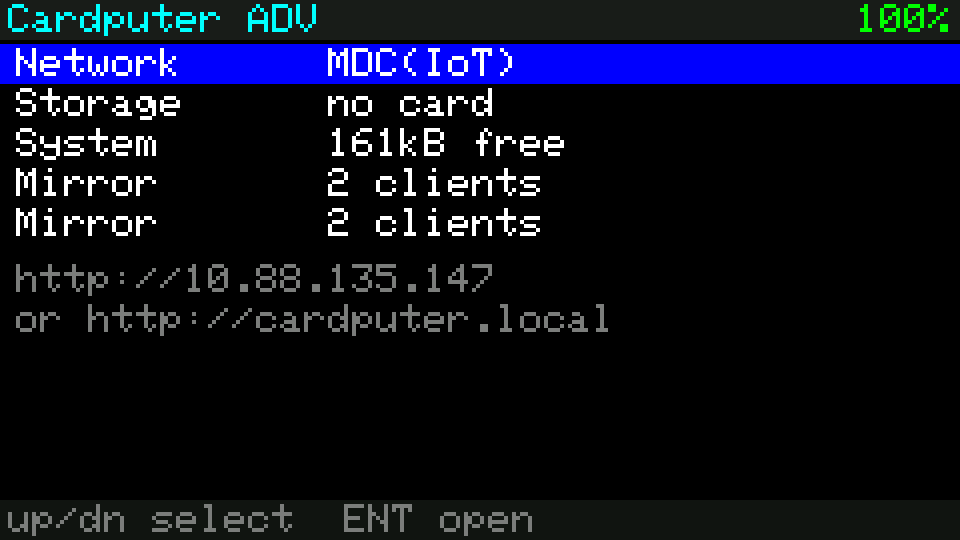
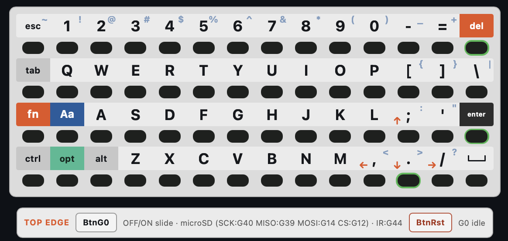

# Cardputer ADV — Browser Display Mirror

Mirror an **M5Stack Cardputer ADV** display in a web browser.
Implements **ADR 0002** (non-invasive GRAM readback); ADRs 0001/0003/0004 are
written and ready to build on top.

```
CardputerMirror.begin();    // setup()  — WiFi + HTTP + WebSocket
CardputerMirror.update();   // loop()   — budgeted scan, pushes changed tiles
```

Browse to the IP printed on the device screen.





The browser page renders the mirrored display alongside a full on-screen
keyboard matching the ADV's physical 4x14 layout — click keys directly to send
them to the device. Prefer typing on your own keyboard? Click **Capture my
keyboard** to toggle passthrough: real keypresses (including arrow keys) are
mapped through the same matrix coordinates a physical press would use, so the
firmware can't tell the difference.

## Why this order (#2 -> #1 -> #4)

The frame source sits behind `IFrameSource`. Swapping ADR 0002's
`ReadbackFrameSource` for ADR 0001's `TeeFrameSource` is a one-line change; the
dirty-tile scheduler, wire protocol, RLE codec and browser UI are shared
verbatim. **ADR 0004 = ADR 0001 + input injection**, so nothing built here is
thrown away. Full reasoning in [`docs/adr/README.md`](docs/adr/README.md).

Starting at #2 first answers the one question source-reading cannot: *does
3-wire GRAM readback actually work on this panel?* The firmware self-tests it at
boot and reports the score in the browser.

## Hardware facts (read from M5 sources, not datasheets)

| Property | Value |
|---|---|
| Board enum | `board_M5CardputerADV = 24` |
| Panel | `Panel_ST7789` 135x240, rotation 1 -> **240x135** |
| SPI | `SPI3_HOST`, write 40 MHz, **read 16 MHz** |
| Pins | MOSI 35, SCLK 36, DC 34, CS 37, RST 33, BL 38 |
| **MISO** | **not wired** (`-1`); `spi_3wire = true` -> half-duplex SIO |
| Read depth | `rgb888_3Byte` — 3 B/px on the wire |
| Keyboard | **TCA8418 I2C**, `matrix(7,8)`, INT **GPIO11** |

## Measured / computed budget

- Shadow framebuffer RGB565: **64,800 B (63.3 KiB)**
- Full-frame readback: 97,200 B -> **48.6 ms @ 16 MHz -> ~20.6 fps ceiling**
- Tile 60x45 (divides 240x135 exactly): 8,100 B -> **4.05 ms**

Codec efficiency, verified by cross-checking the C++ encoder against the shipped
browser decoder (600 fuzz trials + 4 golden vectors, 0 failures):

| Tile content | Wire bytes | vs raw 5,400 B |
|---|---|---|
| Flat fill | 40 | 0.7% |
| Banded | 40 | 0.7% |
| Text-like (sparse) | 856 | 15.9% |
| Noise (worst case) | 5,407 | 100.1% (falls back to RAW) |

## Frame rate vs. application impact

`budgetUs` throttles how much SPI read time `update()` may consume per `loop()`.

| Setting | Tiles/loop | SPI per loop() | Full scan | Realistic fps |
|---|---|---|---|---|
| Gentle (2000us) | 1 | 4.0 ms | 72.6 ms | 13.8 |
| Normal (4500us) | 1 | 4.0 ms | 72.6 ms | 13.8 |
| Fast (9000us) | 2 | 8.1 ms | 60.6 ms | 16.5 |
| Aggressive (20000us) | 4 | 16.2 ms | 54.6 ms | 18.3 |

A full 12-tile scan costs **48.6 ms of SPI time no matter how it is batched**, so
**20.6 fps is an absolute ceiling**. Larger budgets reach it in fewer `loop()`
iterations (less per-iteration overhead), they do not exceed it. Real fps is lower
still: reads contend with the application's own 40 MHz writes. Figures assume ~2 ms
of application work per `loop()`.

## Build

```bash
python3 tools/gen_web_assets.py    # web/index.html -> gzipped PROGMEM header
pio run -t upload
```

Defaults to a SoftAP **`CardputerADV`** / `cardputer`. Set `WIFI_SSID`/`WIFI_PASS`
in `src/main.cpp` to join an existing network.

## Layout

```
docs/adr/            ADR 0001-0004
lib/CardputerMirror/ Mirror, IFrameSource, ReadbackFrameSource, RLE codec
web/index.html       Browser client (canvas + 4x14 ADV keyboard)
tools/               Asset generator + native codec fuzz test
src/main.cpp         Example integration
```

## Known limits (ADR 0002)

- **~20 fps hard ceiling**, lower under load.
- **Tearing** — a tile can be read mid-draw.
- **Missed changes** — content drawn and reverted between two scans of the same
  tile is never seen (CRC sampling).
- **Read-only** — the on-screen keyboard is a layout reference; injection is ADR 0004.
- **Colors** — if wrong, toggle `Swap R/B` / `Invert`; ST7789 revisions differ.
- A self-test well under 100% means readback is unreliable on your unit; ADR 0001
  is then the path forward.

## Verify the codec locally

```bash
c++ -std=c++17 -O2 -o verify_codec tools/verify_codec.cpp && ./verify_codec
```

## Test suite

```bash
for t in tools/test_*.mjs tools/test_*.cjs; do echo "--- $t"; node "$t"; done
```

| test | what it proves |
|---|---|
| `test_keymap.mjs`       | every coordinate agrees with M5Cardputer's `_key_value_map[4][14]` |
| `test_coverage.mjs`     | every enumerated key is reachable from some painted legend |
| `test_dual_legend.mjs`  | dual-legend caps emit both characters from one coordinate |
| `test_dom_keyboard.cjs` | the page **the device serves** builds the keyboard measured in ADR 0022 |

`test_dom_keyboard.cjs` needs jsdom (`npm install --no-save jsdom`); without it
the test prints SKIP and exits 0 rather than failing.

It gunzips `lib/CardputerMirror/WebAssets.h` rather than reading
`web/index.html`, because the latter is a **template** holding the literal
`/*__KEYMAP__*/` placeholder — opened directly it renders a "keymap missing"
notice and every count assertion reads 0. See ADR 0025.

Regenerate assets after editing `web/index.html`:

```bash
python3 tools/gen_web_assets.py && ./tools/pio.sh run -e cardputer-adv
```
